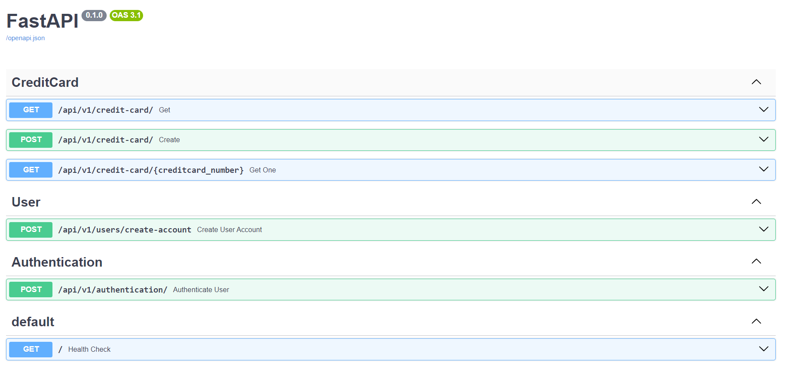

# Credit Card Registry API

API para criação de cartões de crédito com validação usando a LIB  [Python Creditcard](https://github.com/MaisTodos/python-creditcard) 

## Instruções de configuração

1. Clone o repositório 
    
    git clone https://github.com/rotirotirafa/creditcard-registry

2. Ainda na raiz do repositório, aproveite para subir o container do Postgres:````docker compose up -d````

3. Acesse a pasta ```./api```

Inicie o poetry, instale as dependencias no virtualenv criado:
    
    poetry init
    poetry install
    poetry shell


***Verifique no final do documento nas observações o item 1 !!!***

Para criar a base de dados: ```alembic upgrade head```

Para rodar a aplicação, na raiz do repositório use o comando ```uvicorn api.src.main:app --reload```


Print Swagger:


    
Observações:

Optei por desenvolver a API com o FastAPI como framework para criação e exposição de rotas REST, tem sido usado 
globalmente para criação de serviços que exigem eficiência.

No banco de dados eu optei por Postgres, o PostgreSQL é conhecido por ser um sistema de gerenciamento de banco de dados relacional confiável e durável, oferecendo recursos ACID (Atomicidade, Consistência, Isolamento e Durabilidade).

1. Não foi possível usar a lib [Python Creditcard](https://github.com/MaisTodos/python-creditcard) via Pip. Então fiz o clone do repo e instalei manualmente com o Poetry. (faça a mesma coisa caso não seja possível instalar a lib automaticamente)
2. Esse projeto foi desenvolvido com Python 3.11 e com o gerenciador de dependecias Poetry.
3. É necessário Docker para subir o banco de dados (Postgres)
4. Na raiz da pasta API existe um Dockerfile para montar imagem caso haja necessidade futura de subir em AWS, Azure e etc.
5. Acesse o README.md Interno (/api) para lista de TODO's
6. No makefile há comandos como ``run dev``, ``requirements`` e etc.